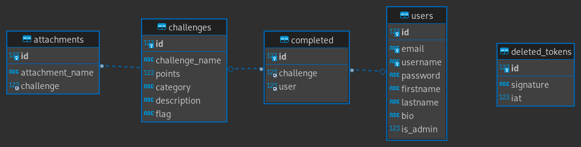
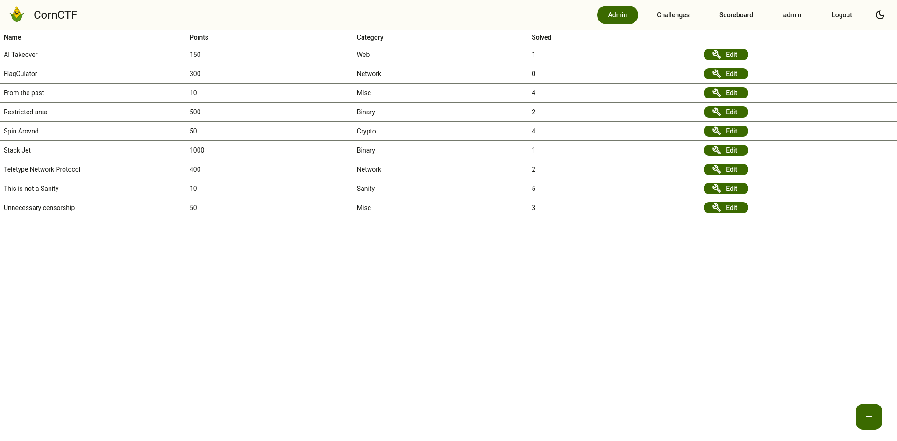
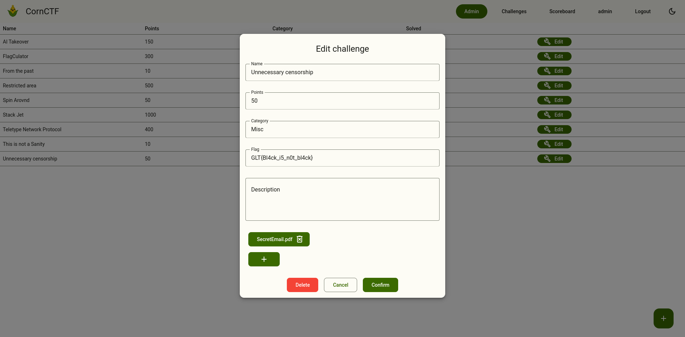
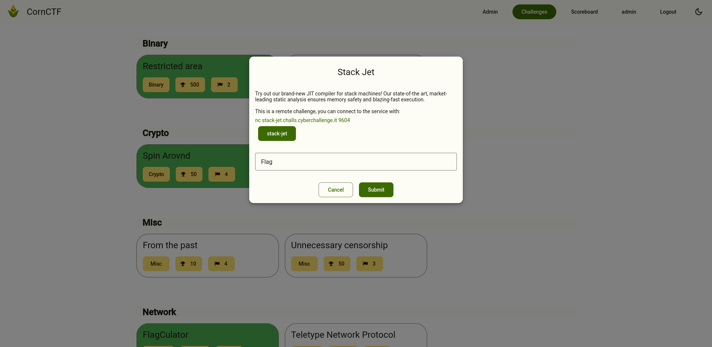

# **[CornCTF](https://saw21.dibris.unige.it/~S4943369)**

Riccardo Isola
Ludovico Capiaghi

---

# Dominio applicativo

Sul nostro sito proponiamo una game-experience nel formato capture-the-flag con Challenge sulla cybersecurity in cui lo scopo è trovare la flag sfruttando le vulnerabilità dei servizi forniti

Il sito è responsive by design, rispettando le [linee guida di google](https://m3.material.io/), utilizzando la libreria [BeerCSS](https://www.beercss.com/)

---

# Il nostro DB

Per implementare il _remember me_ usiamo JWT

---

# Funzionalità aggiuntive

-   Area amministrativa

-   Challenge

